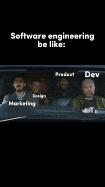

## Hi there, I'm İsmail Yıldız 🖥️ 🚀

Hi, I'm [İsmail Yıldız](https://www.linkedin.com/in/imsims/), a Software Engineer 🖥️ from Turkey.  

### Talking about Personal Stuffs

- I graduated from Duzce University with a degree in Computer Engineering.  
- I currently work as a Software Engineer at Pharmahan, focusing on backend development using Kotlin and C#.  
- I'm passionate about building clean and efficient code, and I often share my knowledge through articles and talks on modern software engineering practices.

### 🧰 Languages and Tools

  
  
  
  
  
  
  
  
  
  
  
  
  
  
  
  
  
  
  
  
  
  

### :octocat: Github Statistics

  
  

